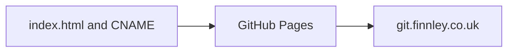

# KeyErrorFinn.github.io

[](https://github.com/KeyErrorFinn/KeyErrorFinn.github.io/commits/main) [](https://github.com/KeyErrorFinn/KeyErrorFinn.github.io/issues)

A minimal GitHub Pages site for the `KeyErrorFinn` account.

## Current page

`index.html` is a small placeholder page titled “Main Page”. The `CNAME` file configures the custom domain used by GitHub Pages.

## How it works

GitHub Pages serves `index.html` directly from the configured publishing branch. There is no build system or server-side component.

## Local preview

Open `index.html` in a browser, or serve the directory with Python:

```bash
python -m http.server 8000
```

Then visit `http://localhost:8000`.

## Deployment

Push changes to the branch selected in the repository's **Settings → Pages** configuration. Keep `CNAME` in the published root if the custom domain should remain active.

<!-- documentation-extras -->

## Project flow



<details>
<summary>Documentation and maintenance notes</summary>

- Commands and behaviour in this README are derived from the files currently committed to the repository.
- External services, games, websites, browser APIs, and file formats can change independently of this project.
- When reporting a problem, include the operating system, runtime version, exact command, and complete error text with secrets removed.

</details>

## Contributing

Focused fixes are welcome. Before changing behaviour, open an issue describing the problem and intended result. Keep credentials, generated secrets, personal data, and machine-specific configuration out of commits. Update this README whenever commands, configuration, paths, or supported behaviour change.

## Licence

No project-level licence is currently declared in this repository. Copyright remains with the repository owner and other contributors; obtain permission before redistributing or incorporating the code elsewhere. Third-party assets and dependencies retain their own licences.
